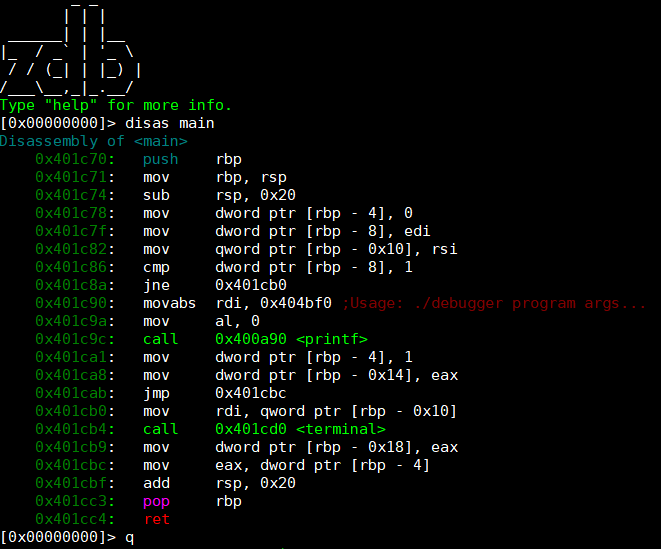

## zdb
zdb is a work in progress debugger for 64 bit elf binaries aiming to provide an experience similar to gdb. At the moment the debugger supports setting breakpoints and stepping, dissassembly with function and string info (via capstone) and showing the stack and the registers. Elf parsing extended on code from https://github.com/TheCodeArtist/elf-parser/blob/master/elf-parser.c to add .plt and .got address resolution.

## How to use.
This is only for linux and you must have capstone installed on your computer. See http://www.capstone-engine.org/. </br>
To compile run `make`. </br></br>
These are the currently supported commands.
```
Commands:
r              - starts/restarts execution.
c              - continues execution until end or breakpoint.
b [addr/func]  - sets break at specified address.
breaks         - shows set breakpoints.
stack [amount] - displays stackdump of [amount] length.
regs           - displays register values.
sect           - displays elf sections.
func           - displays binary functions with plt and got addresses for dynamic ones.
disas [func]   - displays disassembly of specified function.
q              - quits program.
help           - shows this screen.
```
## Example.

